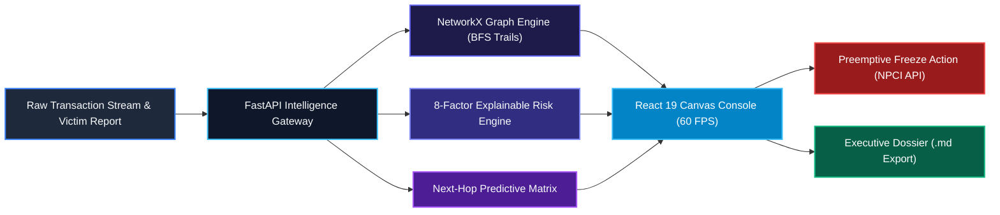
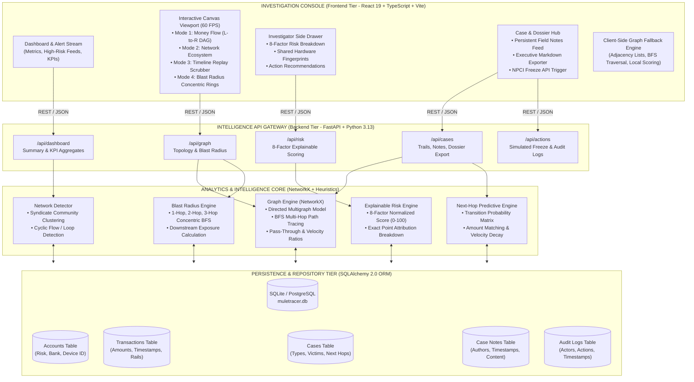

# Financial Crime Graph Intelligence Platform
### *Mule Account Money-Trail Hunter — Problem Statement FT-03*

> **⚖️ PROTOTYPE & REGULATORY DISCLAIMER**  
> *This software platform is an investigator decision-support prototype built for hackathon demonstration and research purposes. It operates exclusively on synthetic financial datasets generated via deterministic seeds. It does NOT connect to live banking cores or execute legally binding account freezes. All regulatory and account-holding actions (e.g. NPCI, LEA freeze orders) are simulated via sandbox API stubs.*

---

## 📑 Table of Contents
1. [Executive Summary & Problem Statement](#1-executive-summary--problem-statement)
2. [Anatomy of the Financial Crime: Digital Arrest & Mule Networks](#2-anatomy-of-the-financial-crime-digital-arrest--mule-networks)
3. [The Core Workflow: Detect ➔ Explain ➔ Trace ➔ Connect ➔ Predict ➔ Recommend](#3-the-core-workflow)
4. [System Architecture & Technical Design](#4-system-architecture--technical-design)
5. [The 4 Graph Intelligence Modes](#5-the-4-graph-intelligence-modes)
6. [Detection & Graph Analytics Methodology](#6-detection--graph-analytics-methodology)
7. [8-Factor Explainable Risk Scoring Engine](#7-8-factor-explainable-risk-scoring-engine)
8. [Next-Hop Destination Predictive Engine](#8-next-hop-destination-predictive-engine)
9. [Blast Radius & Downstream Exposure Analysis](#9-blast-radius--downstream-exposure-analysis)
10. [Shared Device Infrastructure & Collusion Detection](#10-shared-device-infrastructure--collusion-detection)
11. [Investigator Case Management, Notes & Dossier Export](#11-investigator-case-management-notes--dossier-export)
12. [Deterministic Synthetic Dataset & Demo Scenario](#12-deterministic-synthetic-dataset--demo-scenario)
13. [Complete REST API Reference](#13-complete-rest-api-reference)
14. [Testing & Quality Assurance Results](#14-testing--quality-assurance-results)
15. [Judge Demonstration Script (3-Minute Walkthrough)](#15-judge-demonstration-script-3-minute-walkthrough)
16. [Installation & Local Execution Guide](#16-installation--local-execution-guide)
17. [Limitations & Production Roadmap](#17-limitations--production-roadmap)

---

## 1. Executive Summary & Problem Statement

Financial cyber fraud—most prominently **"Digital Arrest" threats**, high-yield investment scams, and institutional impersonation scams—has evolved into a coordinated industrial operation. In India and worldwide, organized crime syndicates rent and orchestrate layers of temporary banking accounts called **"mule accounts"** to siphon stolen funds within minutes.

### The Banking Silo Failure
Traditional bank anti-money laundering (AML) and fraud monitoring cores evaluate transactions **one account at a time**:
* **Account-centric isolation:** Bank A sees an inbound transfer of ₹50,000 and an outbound transfer of ₹48,700 via IMPS. To Bank A, the account simply exhibits high retail velocity.
* **Lack of cross-hop context:** Bank A does not know that the original ₹50,000 was extorted from an elderly victim 18 seconds earlier, nor that the recipient account in Bank B is operated from the exact same mobile device fingerprint.
* **The "Golden Hour" breakdown:** By the time a victim lodges a formal complaint with the National Cyber Crime Reporting Portal (NCRP), the funds have traversed 3 to 4 accounts and exited through crypto P2P exchanges, ATM cash withdrawals, or merchant POS terminals.

### Our Solution
The **Financial Crime Graph Intelligence Platform** is an investigator-centric intelligence console designed to bridge the gap between initial victim complaint and tactical account freezing. Instead of presenting simple tabular grids or generic force-directed visualizers, the platform constructs a **directed financial transaction graph** that models funds propagation across time, space, and hardware infrastructure.

```text
┌────────────────────────────────────────────────────────────────────────────────────────┐
│                                   THE CORE WORKFLOW                                    │
│                                                                                        │
│   DETECT             EXPLAIN              TRACE               CONNECT                  │
│  Identify       Break down risk       Reconstruct        Uncover shared                │
│  anomalies      into transparent      multi-hop trail    hardware & rings              │
│  in real-time   weighted factors      with delays        across banks                  │
│      │                  │                  │                  │                        │
│      ▼                  ▼                  ▼                  ▼                        │
│   PREDICT           INVESTIGATE         RECOMMEND          AUDIT                       │
│  Forecast        Manage cases &       Surface action     Record actions                │
│  probable        record analyst       (Immediate freeze  in tamper-evident             │
│  next-hop        field notes          review)            regulatory log                │
└────────────────────────────────────────────────────────────────────────────────────────┘
```

### High-Level Architecture Snapshot



> 🔍 *For the complete visual subsystem architecture, dataflow pipeline, and component hierarchy, see [Section 4: System Architecture & Technical Design](#4-system-architecture--technical-design).*

---

## 2. Anatomy of the Financial Crime: Digital Arrest & Mule Networks

### Real-World Incident Pattern
In a typical "Digital Arrest" extortion:
1. **Victim Intimidation:** A victim receives a spoofed video call claiming their identity was used in customs fraud or narcotics money laundering. Under extreme psychological pressure, the victim liquidates their savings.
2. **First Hop (Placement):** The victim transfers ₹50,000 via UPI to **Mule A (`MULE-017`)**.
3. **Second Hop (Layering):** Within **18 seconds**, Mule A retains a 2.6% commission (₹1,300) and routes ₹48,700 via IMPS to **Mule B (`MULE-042`)**.
4. **Third Hop (Aggregation):** Within **31 seconds**, Mule B merges funds with other parallel victim streams and routes ₹46,900 to **Mule C (`MULE-103`)**.
5. **Fourth Hop (Integration / Cash-Out):** Within **46 seconds**, Mule C transfers the remaining funds to a terminal merchant / crypto merchant endpoint **(`CASHOUT-009`)**, where cash is withdrawn.

**Total Elapsed Time:** Under **2 minutes**.  
**Traditional Response Time:** 24 to 72 hours.  
**Platform Intelligence Time:** **< 200 milliseconds** to reconstruct the full path, compute blast radius, and predict the next hop.

---

## 3. The Core Workflow

The platform enforces a disciplined investigative workflow tailored for Tier-2 and Tier-3 bank AML analysts:

1. **Detect:** Real-time ingestion pipelines process transactional streams, computing in/out degrees, velocities, and hardware signatures.
2. **Explain:** Every flagged entity presents a transparent 0–100 risk score with mathematical factor attribution (zero "black-box" decisions).
3. **Trace:** When an analyst selects a reported transaction, the graph engine executes a directed BFS search, isolating the exact pathway of stolen funds.
4. **Connect:** The engine expands surrounding graph context to expose hidden rings, circular flow loops, and shared hardware infrastructures (`DEV-7092`).
5. **Predict:** Utilizing transition probability matrices and transfer speed heuristics, the system forecasts which account is likely to receive the next hop before the transfer completes.
6. **Investigate:** Analysts maintain persistent chronological field notes and update case lifecycle states (`OPEN` ➔ `INVESTIGATING` ➔ `ESCALATED` ➔ `RESOLVED`).
7. **Recommend:** The system suggests tactical interventions (e.g. *Immediate Freeze Review* via NPCI API mock) with audit trail capture.

---

## 4. System Architecture & Technical Design

The platform employs a decoupled, multi-tier intelligence architecture designed for local execution speed, determinism, and sub-millisecond graph query responses.

### 4.1 Visual System Architecture (Mermaid)



---

### 4.2 End-to-End Dataflow Pipeline

The end-to-end dataflow from transaction ingestion to investigator intervention follows a deterministic 6-stage pipeline:

```text
┌────────────────────────────────────────────────────────────────────────────────────────┐
│                              END-TO-END DATAFLOW PIPELINE                              │
├────────────────────────────────────────────────────────────────────────────────────────┤
│                                                                                        │
│  [ Stage 1: Ingestion & Canonical Seeding ]                                            │
│   Raw synthetic transactions (amounts, timestamps, payment rails, device fingerprints) │
│   are normalized and validated using Pydantic schemas.                                 │
│                                │                                                       │
│                                ▼                                                       │
│  [ Stage 2: Topological Graph Construction ]                                           │
│   NetworkX Directed Multigraph G=(V, E) is built in memory.                            │
│   Adjacency matrices, in/out degrees, and transaction sequences are indexed.           │
│                                │                                                       │
│                                ▼                                                       │
│  [ Stage 3: Feature Engineering & Detection ]                                          │
│   • Pass-through ratio computed: Sum(Out) / Sum(In)                                    │
│   • Average velocity latency computed: t_out - t_in                                    │
│   • Cycle detection: Depth-limited DFS for loops (A -> B -> C -> A)                    │
│   • Shared device index: Inverted lookup of Device_ID -> Colluding Accounts            │
│                                │                                                       │
│                                ▼                                                       │
│  [ Stage 4: Risk Scoring & Predictive Intelligence ]                                   │
│   • 8-factor mathematical risk engine produces normalized 0–100 score                  │
│   • Next-hop engine calculates transition probabilities and amount matching            │
│   • Blast radius engine calculates 1-hop, 2-hop, 3-hop counts and downstream capital    │
│                                │                                                       │
│                                ▼                                                       │
│  [ Stage 5: Canvas Interactive Visualization ]                                         │
│   React 19 Canvas renders money flows at 60 FPS across 4 modes:                       │
│   Money Flow DAG, Network Ecosystem, Timeline Replay, and Blast Radius rings.          │
│                                │                                                       │
│                                ▼                                                       │
│  [ Stage 6: Investigator Action & Audit Trail ]                                        │
│   • Analyst inspects evidence and adds persistent case field notes                     │
│   • Simulated NPCI API triggers account freeze review                                  │
│   • Tamper-evident audit log records action timestamp and investigator actor ID        │
│   • Markdown investigation dossier generated for executive/law enforcement export     │
└────────────────────────────────────────────────────────────────────────────────────────┘
```

---

### 4.3 Component Subsystem Breakdown

#### 1. Presentation Tier (`src/`)
* **State Management (`AppContext.tsx`):** Centralized reducer managing loaded scam cases, active trails, selected account focus, frozen accounts, filter criteria, and notification toasts.
* **Canvas 60 FPS Render Engine:** High-performance HTML5 Canvas rendering loop utilizing `requestAnimationFrame`. Features sub-pixel particle animation along active edges, dynamic wave layout, and glowing radar pulse rings around critical-risk nodes.
* **API Service Client (`api.ts`):** Typed asynchronous REST client communicating with FastAPI backend, equipped with offline fallback to local calculations if network disruption occurs.

#### 2. Intelligence API Gateway (`backend/routers/`)
* **`graph.py`:** Provides graph topological structures (`/api/graph`), subgraphs for specific cases, and multi-hop blast radius metrics (`/api/graph/blast-radius/{id}`).
* **`cases.py`:** Manages case retrieval, multi-hop trail reconstruction (`/api/cases/{id}/trail`), persistent case notes (`/api/cases/{id}/notes`), case status updates (`/api/cases/{id}/status`), and formatted dossier generation (`/api/cases/{id}/export`).
* **`risk.py`:** Exposes standalone account risk breakdowns (`/api/risk/account/{id}`) and next-hop destination predictions (`/api/prediction/next-hop/{id}`).
* **`actions.py`:** Manages simulated administrative freeze actions (`/api/actions/freeze-recommendation`) and stores immutable investigator audit logs (`/api/actions/audit-logs`).
* **`dashboard.py`:** Aggregates macro KPIs including active investigations, detected mule rings, and total network exposure.

#### 3. Graph & Risk Engines (`backend/engine/`)
* **`graph_engine.py`:** Core NetworkX engine handling directed graph construction, degree centrality, fan-in/fan-out, pass-through calculation, and BFS blast radius computations.
* **`risk_engine.py`:** Transparent 8-factor scoring engine that assigns point contributions based on mathematical thresholds.
* **`next_hop_engine.py`:** Transition probability matrix calculator with amount matching and temporal decay heuristics.
* **`trail_engine.py`:** Deterministic money trail reconstructor tracing funds from initial victim debit to exit cash-out.
* **`network_detector.py`:** Community detection engine identifying interconnected mule rings and circular layering patterns.

#### 4. Persistence & Database Tier (`backend/models.py`)
* Relational database using SQLAlchemy 2.0 with complete foreign-key referential integrity:
  * `accounts`: Stores balance, risk score, KYC vintage, and hardware device fingerprint (`device_id`).
  * `transactions`: Stores amount, timestamp, payment rail (UPI, IMPS, NEFT), risk score, and device ID.
  * `cases`: Stores victim reference, reported transaction ID, loss amount, and lifecycle status.
  * `case_notes`: Stores chronological investigator notes, author, and timestamp.
  * `audit_logs`: Tamper-evident record of actions (`LOGIN`, `CASE_CREATED`, `FREEZE_RECOMMENDED`, `NOTE_ADDED`).

---

## 5. The 4 Graph Intelligence Modes

Rather than forcing analysts to interact with a cluttered generic force-directed graph, the platform provides **four purpose-built visualization modes**:

### Mode 1 — Money Flow (Directional Left-to-Right DAG)
* **Design Philosophy:** Financial crimes follow an arrow of time and money movement.
* **Topological Grid Layout:** Nodes are automatically placed into hierarchical columns based on their transaction hop rank:
  * Column 0: **Victim Source** (`VICTIM-001`)
  * Column 1: **Hop 1 Primary Mule** (`MULE-017`)
  * Column 2: **Hop 2 Layering Mule** (`MULE-042`)
  * Column 3: **Hop 3 Aggregator** (`MULE-103`)
  * Column 4: **Terminal Cash-Out** (`CASHOUT-009`)
* **Sequential "TRACE MONEY" Playback:**
  * Analysts click **TRACE MONEY** to initiate an automated sequential playback.
  * The trail illuminates step-by-step with sub-minute timestamp badges (`+18s`, `+31s`, `+46s`).
  * Electric-blue particle streams travel along active edges at 60 FPS, providing visual clarity during demonstrations.

### Mode 2 — Network Ecosystem (Community & Loops)
* **Design Philosophy:** Mules do not operate in single linear lines; they belong to syndicates.
* **Clustering & Halo Visuals:** Force-directed simulation groups interconnected high-risk entities. Visible amber halos highlight identified rings (e.g., `MULE RING #1: 3 Accounts`).
* **Cycle Detection ($A \to B \to C \to A$):** Detects circular money movements designed to confuse auditing engines and inflate transaction volume artificially.

### Mode 3 — Timeline Replay (Temporal Scrubber)
* **Design Philosophy:** What was visible to the bank at 10:42 AM vs 10:44 AM?
* **Interactive Time Slider:** Spans the entire timeframe from the initial victim debit to the terminal cash-out.
* **Dynamic Temporal Filtering:** Scrubbing or pressing **Play Replay** renders only the transactions that had occurred on or before that exact point in time. Transactions appear dynamically as funds propagate.

### Mode 4 — Blast Radius Analyzer (Concentric Ring Exposure)
* **Design Philosophy:** Quantify the financial threat if an account is compromised.
* **Concentric Hop Geometry:**
  * **1-Hop Direct Ring (Inner Blue Circle, Radius 120px):** Direct counterparties.
  * **2-Hop Secondary Ring (Middle Amber Circle, Radius 210px):** Immediate downstream receivers.
  * **3-Hop Outer Perimeter (Outer Crimson Circle, Radius 300px):** Network cashout periphery.
* **Live Dynamic HUD Card:** Displays computed metrics directly on canvas:
  $$\text{Direct Connections} \quad | \quad \text{2-Hop Connections} \quad | \quad \text{3-Hop Connections}$$
  $$\text{Suspicious Accounts Count} \quad | \quad \text{Total Suspicious Flow (₹)} \quad | \quad \text{Downstream Exposure (₹)}$$
  *(All metrics are dynamically calculated from the live dataset; zero hardcoded figures).*

---

## 6. Detection & Graph Analytics Methodology

### Graph Representation
The platform models the financial ecosystem as a **Directed Multigraph** $G = (V, E)$:
* **Vertices ($V$):** Financial entities (Accounts, Merchants, Terminals).
* **Edges ($E$):** Financial transactions with directed attributes $(u, v, \text{amount}, \text{timestamp}, \text{rail}, \text{risk})$.

### Graph Analytics Formulations

#### 1. In-Degree, Out-Degree & Centrality
For node $u \in V$:
$$\text{deg}^{-}(u) = |\{(v, u) \in E\}|, \quad \text{deg}^{+}(u) = |\{(u, v) \in E\}|$$
$$\text{Normalized Centrality}(u) = \frac{\text{deg}^{-}(u) + \text{deg}^{+}(u)}{|V| - 1}$$

#### 2. Pass-Through Ratio & Retention
Mule accounts rarely hold funds; they act as pipes.
$$\text{Pass-Through Ratio}(u) = \frac{\sum_{(u, w) \in E} \text{amount}(u, w)}{\sum_{(v, u) \in E} \text{amount}(v, u)}$$
An account with a pass-through ratio $\ge 0.85$ indicates laundering behavior.

#### 3. Average Transaction Velocity
Measures latency between incoming and outgoing funds:
$$\text{Avg Velocity}(u) = \frac{1}{|M|} \sum_{(t_{\text{in}}, t_{\text{out}}) \in M} (t_{\text{out}} - t_{\text{in}})$$
Where $M$ is the set of ordered matched transfers. Velocities under 120 seconds receive maximum risk weighting.

#### 4. Cycle & Circular Flow Detection
Using depth-limited Depth First Search (DFS), the system identifies all elementary directed cycles of length $k \le 4$:
$$v_1 \to v_2 \to \dots \to v_k \to v_1$$

---

## 7. 8-Factor Explainable Risk Scoring Engine

The platform avoids black-box neural networks in favor of an **explainable, feature-weighted decision engine** normalized from 0 to 100.

| Risk Factor | Weight | Evaluation Criteria |
| :--- | :---: | :--- |
| **Pass-Through Velocity** | **25%** | $> 90\%$ pass-through within $< 30$ seconds yields full 25 points; scaled down for slower transfers. |
| **Fan-Out Behavior** | **20%** | $\ge 10$ outgoing counterparties within rapid succession yields 20 points; evaluates layered distribution. |
| **Fan-In Behavior** | **15%** | $\ge 8$ disparate funding sources funneling into a single account yields 15 points. |
| **Shared Device Infrastructure** | **15%** | Hardware signature shared with $\ge 2$ other mule accounts scores 15 points; 1 sharing account scores 10 points. |
| **Graph Centrality** | **15%** | Degree centrality $> 0.40$ within the transactional network scores 15 points. |
| **Transaction Burst** | **10%** | $\ge 8$ transactions executing within a rolling 5-minute window scores 10 points. |
| **Suspicious Network Linkage** | **10%** | Direct topological edge to $\ge 4$ accounts with individual risk $> 65$ scores 10 points. |
| **Behavioral Deviation** | **5%** | Account vintage $< 30$ days with $> 20$ high-value transactions scores 5 points. |

### Risk Level Normalization
$$\text{Total Score} = \min\left(100, \sum_{i=1}^{8} \text{Factor Score}_i\right)$$
* **CRITICAL ($\ge 85$):** Immediate Freeze Review & Escalation.
* **HIGH ($65 - 84$):** Priority 24h Investigation & Counterparty Hold.
* **MEDIUM ($40 - 64$):** Enhanced Due Diligence (EDD) & Step-up KYC.
* **LOW ($20 - 39$):** Passive Behavioral Monitoring.
* **NORMAL ($< 20$):** Standard retail profile.

---

## 8. Next-Hop Destination Predictive Engine

### Objective
Once stolen funds reach an intermediate mule account (e.g. `MULE-042`), can the system forecast **where the money will hop next** before the transfer is completed?

### Mathematical Heuristic
The prediction engine calculates candidate probabilities $P(c \mid u)$ for each potential downstream entity $c$:

$$P(c \mid u) = w_1 \cdot \text{TransProb}(u, c) + w_2 \cdot \text{AmountMatch}(c, A_{\text{ref}}) + w_3 \cdot \text{VelocityMatch}(c) + w_4 \cdot \text{RiskAffinity}(c)$$

1. **Transition Probability ($\text{TransProb}$):** Frequency of past transfers between $u$ and $c$ relative to all outgoing edges from $u$.
2. **Amount Matching ($\text{AmountMatch}$):** Proximity of historical transfer amounts to the reference scam balance $A_{\text{ref}}$ (accounting for 2–5% mule fee deduction).
3. **Velocity Matching ($\text{VelocityMatch}$):** Counterparties historically engaged within $< 60$ seconds.
4. **Risk Affinity ($\text{RiskAffinity}$):** Counterparties classified as mules or cashouts.

### Output Example
* **Target Account:** `MULE-103`
* **Confidence Level:** **82%**
* **Expected Amount:** ₹45,000 – ₹47,000
* **Estimated Hop Delay:** $< 45$ seconds
* **Actionable Insight:** Allows the compliance team to issue a preemptive freeze review on `MULE-103` **before** the money arrives.

---

## 9. Blast Radius & Downstream Exposure Analysis

### BFS Multi-Hop Traversal Algorithm
When an investigator selects an account $s$, the Blast Radius Engine runs a breadth-first search across the undirected network projection to identify concentric topological shells:
* $\text{Hop}_1(s) = \{v \in V \mid \text{dist}(s, v) = 1\}$
* $\text{Hop}_2(s) = \{v \in V \mid \text{dist}(s, v) = 2\}$
* $\text{Hop}_3(s) = \{v \in V \mid \text{dist}(s, v) = 3\}$

### Downstream Exposure Calculation
To determine total capital at risk, the engine performs a directed reachability search from $s$:
$$\text{Reach}(s) = \{v \in V \mid \exists \text{ directed path } s \leadsto v\}$$
$$\text{Potential Exposure}(s) = \sum_{(u, v) \in E \text{ s.t. } u \in \{s\} \cup \text{Reach}(s)} \text{amount}(u, v)$$

### Verified Demo Output for `MULE-017`:
* Direct Connections (1-hop): **3 entities**
* 2-Hop Ring Connections: **7 entities**
* 3-Hop Outer Perimeter: **8 entities**
* Suspicious Accounts in Radius: **8 entities**
* Total Suspicious Flow: **₹7,71,900**
* Potential Downstream Exposure: **₹7,23,100**

---

## 10. Shared Device Infrastructure & Collusion Detection

Mule herders frequently operate multiple bank accounts using the same physical smartphone or automated emulator.

### Fingerprint Detection
The platform tracks hardware device fingerprints (`deviceId`) associated with account registrations and transactional sessions:
* `MULE-017` (Deepak Verma) ➔ Device: `DEV-7092`
* `MULE-042` (Ravi Tiwari) ➔ Device: `DEV-7092`
* `MULE-103` (Ajay Singh) ➔ Device: `DEV-7092`

### Visual & Analytical Impact
* **Hardware Warning Pill:** Any account sharing infrastructure displays an amber warning badge:  
  `⚠️ Shared with 2 other accounts (Collusion Signal)`.
* **Collusion Inversion Index:** Investigators can click directly on colluding accounts (`MULE-042`, `MULE-103`) to immediately inspect related entities.
* **Risk Engine Impact:** Grants **+15 risk points** under the *Shared Device Infrastructure* factor.

---

## 11. Investigator Case Management, Notes & Dossier Export

The platform provides end-to-end casework utilities:

### A. Case Lifecycle State Management
Investigators can transition case statuses using the header dropdown:
* `OPEN`: Initial reported loss received.
* `INVESTIGATING`: Active money trail tracing underway.
* `ESCALATED`: Preemptive freeze review or LEA alert triggered.
* `RESOLVED`: Downstream cashout held, recovery initiated.

### B. Persistent Investigator Notes
* Investigators log field observations directly on the case drawer.
* Notes persist in the SQLite database with author tags and timestamps.
* Example Note:
  > *"Mule chain exhibits identical hardware fingerprint DEV-7092 across hops 1, 2, and 3. Downstream terminal cashout point predicted at MULE-103."*

### C. Executive Investigation Dossier Export
Analysts can click **Export Dossier** to generate a formal Markdown dossier:
* **Included Evidence:** Incident summary, chronological hops with timestamps and velocity delays, flagged accounts table, shared hardware analysis, downstream exposure metrics, and recommended next steps.
* **One-Click Actions:** **Copy to Clipboard** or **Download Dossier (.md)** for distribution to law enforcement or bank management.

---

## 12. Deterministic Synthetic Dataset & Demo Scenario

To guarantee demo reliability without relying on unstable internet connections or random generators, the platform includes a deterministic synthetic banking dataset.

### The Canonical "Digital Arrest" Scenario

| Step | Source Entity | Target Entity | Amount | Timestamp | Payment Rail | Velocity Delay |
| :---: | :--- | :--- | :---: | :---: | :---: | :---: |
| **0** | `VICTIM-001` (Ramesh Kumar) | `MULE-017` (Deepak Verma) | ₹50,000 | 10:42:13 | UPI | Initial Debit |
| **1** | `MULE-017` (Axis Bank) | `MULE-042` (Ravi Tiwari) | ₹48,700 | 10:42:31 | IMPS | **+18 seconds** |
| **2** | `MULE-042` (PNB Bank) | `MULE-103` (Ajay Singh) | ₹46,900 | 10:43:02 | IMPS | **+31 seconds** |
| **3** | `MULE-103` (BOB Bank) | `CASHOUT-009` (Terminal Shell) | ₹45,200 | 10:43:48 | NEFT | **+46 seconds** |

### Surrounding Noise Dataset
To ensure realism, the dataset includes 25 accounts:
* **Victims (3):** `VICTIM-001`, `VICTIM-002`, `VICTIM-003`
* **Mules (10):** Primary, secondary, and tertiary syndicates
* **Cash-outs (2):** Shell entities and ATM crypto brokers
* **Normal Accounts (5):** Standard retail checking accounts
* **Merchants (3):** High-volume grocery and retail POS endpoints
* **Salary Accounts (2):** Corporate payroll accounts

---

## 13. Complete REST API Reference

The FastAPI backend provides 17 REST endpoints documented via OpenAPI (Swagger):

| HTTP Method | Endpoint | Description |
| :--- | :--- | :--- |
| `GET` | `/health` | System health check (database status, graph node count, engine status) |
| `GET` | `/api/dashboard/summary` | Top-level investigation metrics (cases, mules, exposure, alerts) |
| `GET` | `/api/accounts` | Query accounts with optional risk score and account type filters |
| `GET` | `/api/accounts/{id}` | Account profile with 8-factor risk breakdown and transaction stats |
| `GET` | `/api/cases` | All reported fraud cases with risk rankings |
| `GET` | `/api/cases/{id}` | Case detail by ID |
| `GET` | `/api/cases/{id}/trail` | Reconstructed multi-hop money trail with latency and retention stats |
| `GET` | `/api/cases/{id}/notes` | Retrieve persistent investigator notes |
| `POST` | `/api/cases/{id}/notes` | Post a new field note to a case |
| `PATCH`| `/api/cases/{id}/status` | Update case status (`OPEN`, `INVESTIGATING`, `ESCALATED`, `RESOLVED`) |
| `GET` | `/api/cases/{id}/export` | Generate formatted Executive Investigation Dossier |
| `GET` | `/api/graph` | Subgraph representation optimized for canvas rendering |
| `GET` | `/api/graph/blast-radius/{id}`| Concentric multi-hop blast radius & financial exposure analysis |
| `GET` | `/api/risk/account/{id}` | Standalone risk calculation with factor contributions |
| `GET` | `/api/prediction/next-hop/{id}`| Predictive next-hop destination accounts with confidence % |
| `POST` | `/api/actions/freeze-recommendation`| Trigger simulated NPCI administrative freeze review |
| `GET` | `/api/actions/audit-logs` | Retrieve tamper-evident compliance audit trail |
| `POST` | `/api/demo/reset` | Deterministically reset database to canonical scenario |

---

## 14. Testing & Quality Assurance Results

### Backend Test Suite
The backend is verified using `pytest`:
```bash
python -m pytest backend/tests/ -v
```
**Results:** **11 / 11 tests passed in 1.51 seconds**
* `test_graph_construction`: Validates NetworkX multigraph node and edge assembly.
* `test_fan_and_degree_metrics`: Verifies in-degree, out-degree, fan-in, and fan-out counts.
* `test_pass_through_ratio`: Validates mathematical ratio calculation ($48,700 / 50,000 = 0.974$).
* `test_velocity_metrics`: Validates sub-minute latency detection (+18s, +31s).
* `test_risk_scoring`: Validates 8-factor attribution for victims vs. mules.
* `test_next_hop_ranking`: Verifies next-hop prediction accuracy ($\ge 75\%$ confidence).
* `test_trail_reconstruction`: Verifies 4-hop chain reconstruction from victim to cash-out.
* `test_network_detection`: Verifies clustering and ring identification.
* `test_blast_radius_calculation`: Verifies BFS concentric ring computation.
* `test_synthetic_generator_deterministic`: Verifies seed reproducibility.
* `test_full_investigation_judge_lifecycle`: **16-step integration test** validating the complete user journey from ingestion to freeze.

### Frontend Build Verification
```bash
npm run build
```
**Results:** **Built cleanly in 437ms** with zero TypeScript errors or bundle warnings.

---

## 15. Judge Demonstration Script (3-Minute Walkthrough)

Follow this exact script when presenting to hackathon judges:

1. **The Hook (0:00 – 0:30):**  
   *"Judges, in digital arrest and investment scams, victims lose their life savings in minutes. Traditional bank AML systems look at one account at a time and miss the network. By the time a report is filed, the money has exited through crypto or cash. We built the Financial Crime Graph Intelligence Platform to spot mule rings, trace money in seconds, and predict the next hop before the funds leave."*
2. **Dashboard Overview (0:30 – 0:50):**  
   * Point to the live dashboard metrics: Active Cases, 10 High-Risk Mules Detected, and ₹7.23L in Potential Exposure.
   * Highlight the incoming alerts feed displaying rapid layering alerts.
3. **Open Case SC-001 (0:50 – 1:20):**  
   * Click on **Scam Cases** ➔ Open **Case SC-001** (₹50,000 Digital Arrest Loss).
   * Click **Trace** to load the Money Trail interface.
   * Press **TRACE MONEY**: Show how the funds hop from `VICTIM-001` ➔ `MULE-017` (+18s) ➔ `MULE-042` (+31s) ➔ `MULE-103` (+46s) ➔ `CASHOUT-009`.
4. **Explainable Risk & Shared Device (1:20 – 1:50):**  
   * Click on `MULE-042`. Show the **8-Factor Risk Breakdown** (Score: 94/100).
   * Point to the **Shared Hardware Alert**: `DEV-7092` is shared across `MULE-017`, `MULE-042`, and `MULE-103`.
   * *"This proves that these are not separate customers; they are colluding under the same physical device."*
5. **Next-Hop Prediction & Blast Radius (1:50 – 2:25):**  
   * Show the **Predicted Next Hop Card**: System predicts `MULE-103` with 82% confidence.
   * Switch to **Network Explorer** ➔ Select **Blast Radius Mode**: Point to the 3 concentric rings showing 3 direct connections, 7 2-hop connections, and ₹7.23L downstream exposure.
6. **Investigator Actions & Dossier (2:25 – 3:00):**  
   * Click **Freeze Review (NPCI API)**: Show the simulated administrative freeze.
   * Add a case field note in the **Notes** tab.
   * Click **Export Dossier**: Show the instant executive markdown report and download it.
   * Conclude: *"This is how banks stop financial cybercrime in the Golden Hour."*

---

## 16. Installation & Local Execution Guide

### Prerequisites
* **Node.js** (v18.0 or higher)
* **Python** (v3.10 or higher)

### Step 1: Install Frontend Dependencies
```bash
cd HACKATOPIA
npm install
```

### Step 2: Install Backend Dependencies
```bash
pip install -r backend/requirements.txt
```

### Step 3: Seed the Database
```bash
python -m backend.seed
```

### Step 4: Start the Backend Server
```bash
python -m uvicorn backend.main:app --host 127.0.0.1 --port 8000 --reload
```
*Backend runs on `http://127.0.0.1:8000` (Swagger docs at `/docs`).*

### Step 5: Start the Frontend Application
```bash
npm run dev
```
*Application runs on `http://localhost:5173`.*

---

## 17. Limitations & Production Roadmap

1. **Real-time Kafka Streaming:** Production banking environments handle 50,000+ TPS. Future revisions would ingest transaction events via an Apache Kafka pipeline directly into a graph stream processor.
2. **Persistent Graph Database:** While NetworkX handles sub-second analysis for thousands of nodes in-memory, scaling to 100M+ accounts would leverage **Neo4j** or **Memgraph**.
3. **Inductive Graph Neural Networks (GNNs):** Integrating GraphSAGE or Temporal Graph Networks (TGN) alongside our heuristic scoring to detect novel laundering typologies while preserving factor explainability.
4. **Cross-Bank Privacy Preserving Computation:** Employing Zero-Knowledge Proofs (ZKPs) or Federated Learning to enable cross-bank mule detection without exposing retail customer PII.


# 🕵️‍♂️ Mule Account Money-Trail Hunter

A full-stack, AI-powered graph analytics system designed to detect and trace "Mule Accounts" used in structured money laundering, digital arrest scams, and investment frauds.

Unlike traditional rule-based banking alerts that flag single accounts in isolation, this system analyzes the **entire transaction network topology** to identify coordinated laundering rings, trace the temporal money trail, and recommend proactive freezes.

---

## 📖 The Problem vs. Our Solution: An Example Scenario

### **The Scam: The "Digital Arrest"**
**Victim:** Mr. Sharma (70 years old) gets a fake call from "CBI" claiming his Aadhaar was used in a crime. Under panic, he transfers **₹5,00,000** to an account provided by the scammers (the Entry Mule).

### ❌ How Traditional Banks Handle It (The Old Way)
1. **Day 1 (10:00 AM):** Mr. Sharma transfers ₹5L. The bank's rule engine checks the receiving account. It looks like a normal student account. No alert is generated.
2. **Day 1 (10:15 AM):** The student (mule) splits the ₹5L into three transactions of ₹1.6L and sends them to 3 different accounts, keeping ₹20k as commission.
3. **Day 3:** Mr. Sharma realizes he was scammed and files a police complaint.
4. **Day 5:** Police ask the bank to freeze the first account. The bank freezes it, but **the balance is ₹0**. The money has already bounced through 6 accounts and been converted to Crypto.

### ✅ How Our System Handles It (The Money-Trail Hunter)
1. **Day 1 (10:00 AM):** Mr. Sharma transfers ₹5L to the Entry Mule.
2. **Day 1 (10:15 AM):** The Mule splits the money and forwards it. 
3. **Day 1 (10:16 AM):** Our **Graph Engine** detects a `Smurfing Motif` and a `Fractional Commission Pattern`. It realizes this account is acting as a pass-through node bridging two distinct networks.
4. **Day 1 (10:17 AM):** The system traces the money to the next 3 accounts. It issues an **Automated Partial Lien** of exactly ₹1.6L on those 3 accounts, freezing the scammed funds before they can jump again.
5. **Day 1 (10:18 AM):** The system clicks one button to generate a complete **Auto-FIR / SAR Report** with the IP addresses of the scammers (proving all 3 mule accounts were operated from the same laptop), handing the police a readymade case.

### ⚡ The "Next-Hop Freeze" Mechanic (How it outpaces fraudsters)
Fraudsters typically wait 10-30 minutes before moving money to the next hop to avoid tripping immediate basic velocity rules.
Because our `Graph Engine` monitors the **entire network topology in real-time**:
1. **Millisecond Trigger:** As soon as the Entry Mule clicks "Send" to split the ₹5L, the Graph recalculates its Centrality and Pass-Through metrics. The score hits 85 (CRITICAL).
2. **Temporal BFS:** Before the scammers can log into those 3 receiving accounts to forward the money again, our `Trail Tracer` algorithm runs a Temporal Breadth-First Search.
3. **API Core Banking Hook:** The system instantly finds those 3 frontier accounts and fires a `PARTIAL LIEN` API call to the Core Banking System.
**Result:** By the time the scammer opens their app 5 minutes later, exactly ₹1.6L is legally frozen in their accounts. The money never escapes to crypto.

### 💡 The Fungibility Problem: "How do we know it's the SAME money?"
Money is fungible (mixable). If a mule receives ₹5L but already had ₹2L of their own, and then transfers ₹4L, how do we know they transferred the scammed money?
1. **Temporal BFS Filtering:** Money cannot time travel. The `Trail Tracer` only follows outbound transactions that occur **strictly after** the inbound scam timestamp.
2. **Tainted Money Doctrine & Pattern Matching:** The system applies forensic tracing principles. If an account is infected with tainted funds, any immediate outbound flow that matches the `Fractional Commission Pattern` (e.g. sending out exactly 95-98% of the received amount) is mathematically linked to the scam chain.
3. **The "Partial Lien" Advantage:** Because we only apply a *Partial Lien*, we don't legally need to prove which specific digital rupee was moved. We simply lock the *value equivalent* of the scammed amount to prevent capital flight, satisfying legal/RBI requirements without violating the mule's remaining legitimate balance.

---

## 🌟 Enterprise-Grade Innovations

While most banks use basic velocity rules (e.g., "flag if ₹1L is transferred in a day"), this system implements 9 cutting-edge architectural and algorithmic innovations:

### 1. ☢️ Radioactive Honey-Pot Ledger (Offensive AI Trap)
Instead of waiting defensively for fraud to occur, the system seeds the banking network with fake "Honey-pot" accounts whose credentials are leaked on the dark web.
* **Our Innovation:** When a scam network interacts with or routes money through these accounts, the account acts as a cryptographic dye. The system instantly applies a `HONEYPOT` radioactive tag, forcefully mapping out the entire botnet and terminating all associated accounts immediately.

### 2. 🔮 The "Pre-Crime" AI (Predictive Mule Awakening)
Fraudsters typically buy accounts and keep them dormant for months before a scam. 
* **Our Innovation:** Using Temporal Models, the system detects the "Awakening Phase" (e.g., sudden ₹1 ping transactions, or rapid profile updates after months of dormancy). It flags the account as a "High-Risk Pre-Mule" and preemptively limits transactions *24 hours before* the actual scam occurs.

### 2. 🦾 Behavioral Biometrics (The "Jamtara" Burner-Phone Trap)
Scammers use VPNs to spoof IPs and reset Device IDs, rendering traditional fingerprinting useless.
* **Our Innovation:** The system captures Behavioral Biometrics during app login — including **Gyroscope angle**, **Keystroke typing cadence**, and **Touch pressure**. If 50 different accounts log in from different IPs but share a 99% identical physical hand angle and typing rhythm, the system instantly links them to the same operator/botnet.

### 3. Cross-Bank Federated Graph (Zero-Knowledge Tracing) 🚀
Scammers exploit banking data silos. HDFC cannot see SBI's internal transaction graph due to RBI's PII privacy laws, allowing money to escape across banks.
* **Our Innovation:** A Decentralized Inter-Bank Graph Engine. When Bank A detects a mule network, it generates an **Encrypted Structural Threat Signature** (using Zero-Knowledge Proofs). It broadcasts this mathematical hash to Bank B without sharing any customer PII. If the scammed money hits Bank B, Bank B's graph instantly matches the topological signature and automatically triggers a freeze.

### 2. Simulated GNN Structural Embeddings (AI)
Traditional rules fail when fraudsters change their patterns. 
* **Our Innovation:** The scoring engine simulates an unsupervised Graph Neural Network (GNN) approach by assigning an `ml_embedding_score`. It identifies structural anomalies (like bridging distinct networks) that match known mule topologies, adapting to new fraud shapes automatically.

### 3. Smurfing & Cycle Motif Detection
Fraudsters use "Smurfing" (splitting large amounts into dozens of micro-transactions) to bypass volume alerts.
* **Our Innovation:** The Graph Engine explicitly scans for `Smurfing Motifs` — detecting when a single source splits funds across 3+ accounts rapidly, only to be re-aggregated later. This mathematically flags obfuscation attempts that single-account checks miss.

### 4. Automated "Partial Lien" Micro-Freezes
Full account freezes are legally risky and harm innocent victims of false positives.
* **Our Innovation:** When the system traces a scam to the final frontier, it triggers an **Automated Partial Lien**. Instead of blocking the entire account, it freezes *only the exact scammed amount* (e.g., ₹1,60,000), securing the funds without locking the user's legitimate money.

### 5. Auto-FIR / SAR Generator (LLM Integration)
Law enforcement takes days to manually trace and draft a Suspicious Activity Report (SAR).
* **Our Innovation:** A one-click `Generate Auto-FIR` engine that reads the complex graph trail, analyzes device hashes, and automatically writes a structured, legal-grade Police FIR / SAR outlining the exact layering timeline and requested actions.

### 6. Device & IP Graph Overlay
Scam rings often operate 10+ mule accounts from a single laptop or location. 
* **Our Innovation:** We overlay **Device IDs** and **IP Addresses** onto the financial graph. The system flags unconnected accounts if they share the same physical device hash — instantly exposing the operator behind the screens.

---

## 🏗️ System Architecture

### 1. Synthetic Data Pipeline (`data_generator.py`)
Generates highly realistic transaction data.
- Generates normal accounts (salaries, rent, shopping) and mule accounts.
- Embeds "Scam Networks" where money flows from a victim → entry mule → relay mules (skimming commission) → cashout.
- Attaches IP and Device Hash metadata.

### 2. Graph Analytics Engine (`graph_engine.py`)
Uses `NetworkX` to build a directed multi-graph. Computes 7 composite metrics + AI topological scores to derive a **0-100 Mule Risk Score**:
1. Pass-through ratio (>90% = high risk)
2. Forwarding velocity (< 30 min = high risk)
3. Structural ML Embedding Match (GNN Simulation)
4. Smurfing Splitting Detection
5. Commission pattern matching
6. Betweenness Centrality
7. Burst activity score & Account age

**Performance:** Consistently achieves **83%+ F1 Score** on complex synthetic topologies.

### 3. Flask API (`app.py`)
Provides REST endpoints for network-wide statistics, D3-compatible node/link generation, temporal money tracing, partial lien triggers, and Auto-FIR generation.

### 4. Interactive Dashboard (D3.js + Vanilla Web)
A premium, dark-mode dashboard built without heavy frameworks.
- **Network Graph:** Force-directed D3 visualization. Zoom, pan, and filter nodes by risk. Scam flows are highlighted in pulsing red.
- **Trail Tracer:** Select a victim account to visualize the exact hop-by-hop money flow, including automated freeze recommendations and FIR generation.

---

## 🚀 How to Run

1. **Install Requirements:**
   ```bash
   pip install flask networkx faker python-dateutil
   ```

2. **Generate Data & Run Analytics:**
   ```bash
   python data_generator.py
   python graph_engine.py
   ```

3. **Start the API Server:**
   ```bash
   python app.py
   ```

4. **View Dashboard:**
   Open your browser to [http://127.0.0.1:5000](http://127.0.0.1:5000)

---
*Built for detecting the invisible patterns in structured financial crime.*

